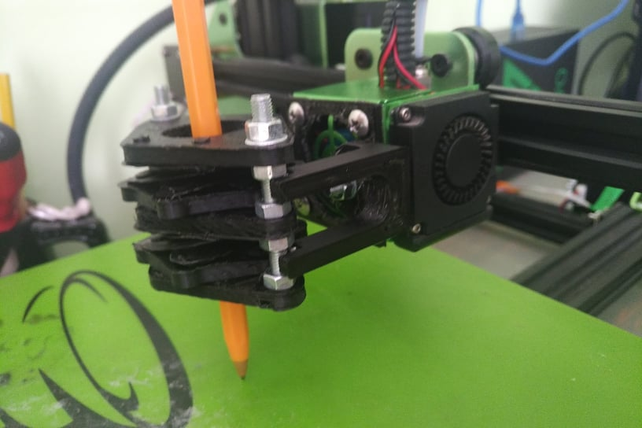

# Iris plotter extension for 3d printer

### Description

Mod for Tevo tornado printer that adds function of a plotter. Model is designed to hold pens and markers of a diameter up to 25mm. No matter the width of the pen it should self-center. Plate that holds the iris mechanism is designed with magnetic quick realese. Iris mechanisms can be stacked on top of each orther provided the bolts are long enough.

### Assembly

For minimal assembly you'll have to print:
1. 2x iris base 
2. iris top
3. 6x iris wing
4. 12x iris wing pin

### Some more info and issues

It took me 4 iterations of iris model, i left my previous attemps in freecad files. The last attempt should work as the model was built with beeing parametric in mind. Although freecad has topologic nameing bug of which i was not aware during modeling. So the models might break while changing some parameters, I am not sure. 
